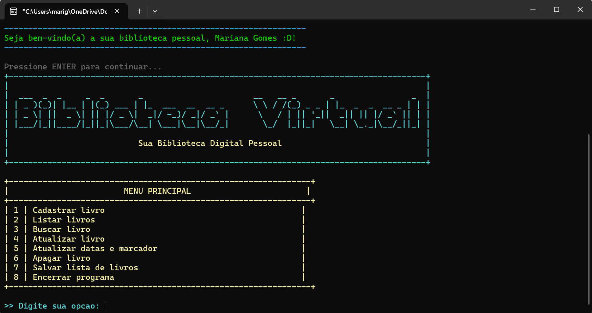
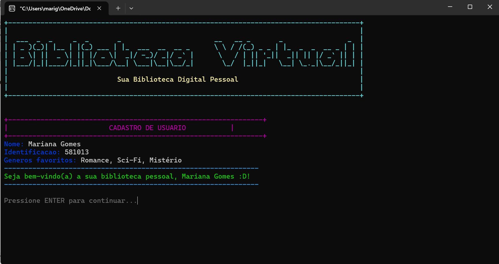

# Digital Library in C 📚

Projeto desenvolvido para a disciplina de Fundamentos de Programação da UFC utilizando linguagem C.

O sistema funciona como uma biblioteca digital no terminal, permitindo cadastrar e organizar livros com persistência de dados em arquivos `.txt`.

## 🛠️ Tecnologias utilizadas

- C
- Structs
- Manipulação de arquivos
- Manipulação de strings

## 📷 Screenshots

### Menu principal



### Cadastro de usuário



## ▶️ Como executar

```bash
gcc src/main.c -o biblioteca
```

No Windows:

```bash
biblioteca.exe
```
